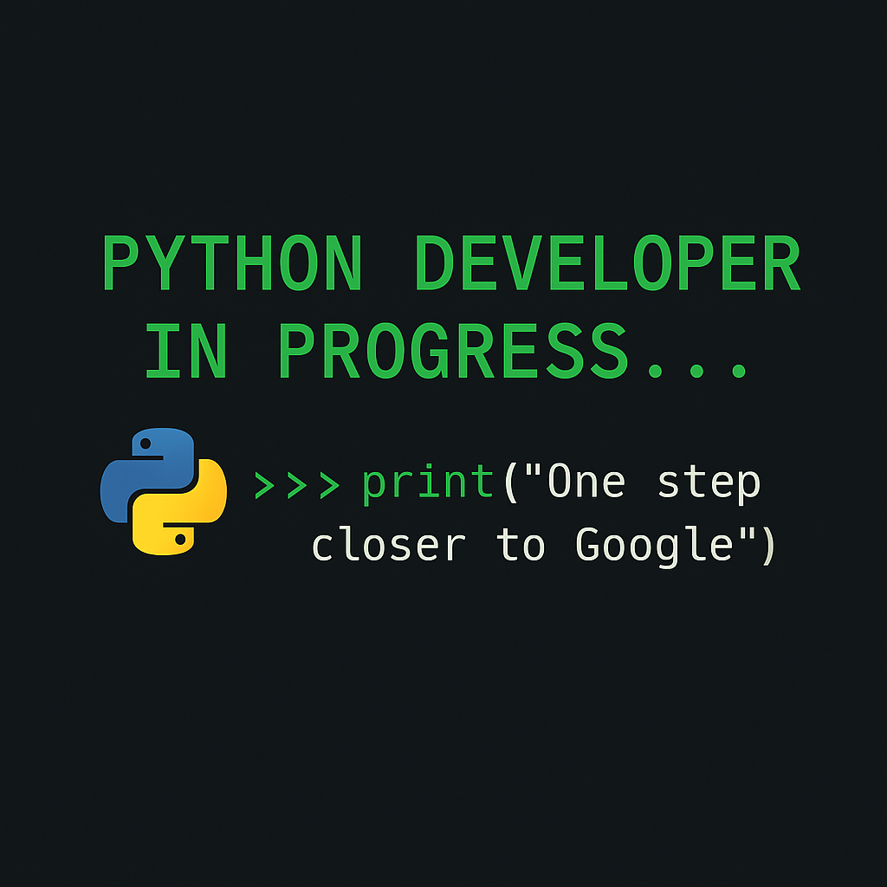

<div align="center">
  
  <h1>🚀 Python Journey to Google</h1>
  <p><i>by <strong>Ikrash Ibn Haroon</strong> — A daily learning repo aiming to become a Python Developer at Google 👨‍💻🌍</i></p>

  <p>
    
    
    
  </p>
</div>


---

## 📌 About This Repository

Welcome to my personal roadmap — a focused, daily Python practice repository with one **bold goal**:

> **Become a Python Developer at Google.**

This journey is about **discipline, consistency, and growth**. Every folder, every commit, and every problem solved brings me one step closer to the dream. ✨

### 🔧 Highlights:
- 📅 **Daily Practice:** Committing every single day.
- 💡 **Real-World Problems:** From beginner to advanced level.
- 📂 **Clean Folder Structure:** Easy to navigate.
- 📈 **Consistent Progress:** No zero days.
- 🧪 **Modules + Problem Solving:** Learning through doing.

---

## 🧠 Folder Structure

```plaintext
python-journey-to-google/
├── Chapter 1/
│   ├── module.py
│   └── CH 1 - PS/
│       └── problem1.py
├── Chapter 2/
│   ├── variables.py
│   ├── datatypes.py
│   ├── operators.py
│   ├── inputs.py
│   └── CH 2 - PS/
│       ├── Problem1.py
│       ├── Problem2.py
│       ├── Problem3.py
│       ├── Problem4.py
│       ├── Problem5.py
│       └── Problem6.py
├── Chapter 3/
│   ├── 01_String-intro.py
│   ├── 02_String-slicing.py
│   ├── 03_Negative-slicing.py
│   ├── 04_Slicing-skip-value.py
│   ├── 05_StrFunctions.py
│   ├── 06_Escap_seq.py
│   └── CH 3 - PS/
│       ├── Problem1.py
│       ├── Problem2.py
│       ├── Problem3.py
│       ├── Problem4.py
│       └── Problem5.py
├── Chapter 4/
│   ├── 01_list.py
│   ├── 02_list_methods.py
│   ├── 03_tuple.py *(coming soon)*
│   ├── 04_tuple_methods.py *(coming soon)*
│   └── CH 4 - PS/
│       ├── Problem1.py
│       ├── Problem2.py
│       ├── Problem3.py
│       ├── Problem4.py
│       └── Problem5.py
├── Chapter 5/
│   ├── 01_Dictionary.py
│   ├── 02_Dictionary-methods.py
│   ├── 03_set.py
│   ├── 04_set-methods.py
│   ├── 05_set_union-intersection.py
│   └── CH 5 - PS/
│       ├── Problem1.py
│       ├── Problem2.py
│       ├── Problem3.py
│       ├── Problem4.py
│       └── Problem5.py
│       ├── Problem6.py
│       ├── Problem7.py
│       ├── Problem8.py
│       ├── Problem9.py
├── README.md
└── roadmap.md (coming soon)

```
🌟 Vision
I believe in dreaming big and working daily to make it real. This repo is not just about code — it's about resilience, clarity, and mastering Python with the intent to join Google as a developer someday. 🏁

🤝 Let's Connect!
If you're on a similar journey or want to collaborate or motivate each other — reach out!

📬 Email: ikrashharoon1236@gmail.com

Feel free to ⭐ the repo if you find it inspiring, and let’s grow together!

<p align="center"> Built with ❤️ by <strong>Ikrash Ibn Haroon</strong> • #PythonistInProgress 🐍 </p>
