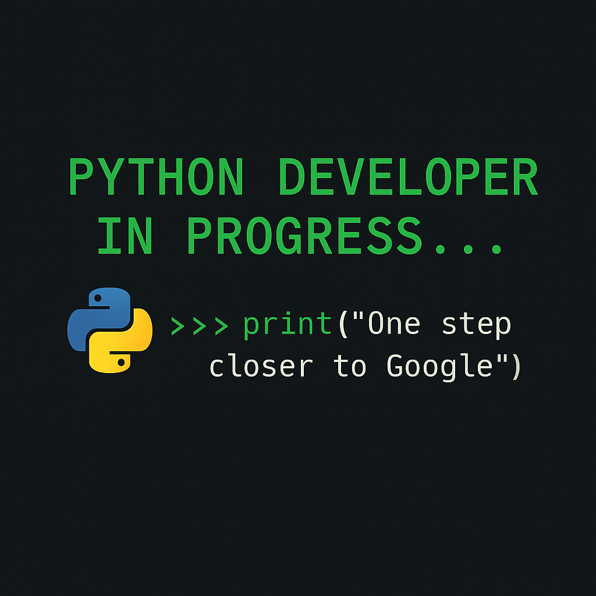

<div align="center">
  
  
  <h1>🚀 Python Journey to Google 🐍</h1>
  <p><i>by <strong>Ikrash Ibn Haroon</strong> — A daily learning repository aimed at becoming a Python Developer at Google 👨‍💻🌍</i></p>

  <p>
    
    
    
    
    
  </p>

  
</div>

---

## 📌 About This Repository

Welcome to my personal roadmap — a focused, daily **Python learning journey** with one bold goal:

> **🎯 To become a Python Developer at Google.**

> **📢 Note:** This repository officially concludes at **Chapter 8**.  
> Advanced problem-solving and mega projects will continue in a **new repository**. 🚀  

This journey reflects **discipline, persistence, and growth**.  
Every folder, every commit, and every solved problem marks another step toward the dream. 🌟  

---

## ✨ Highlights

- 📅 **Daily Practice:** Committing progress every single day  
- 💡 **Real-World Problems:** From beginner to advanced level  
- 🧩 **Clean Folder Structure:** Organized and easy to navigate  
- 📈 **Consistent Growth:** No zero days mindset  
- 🧪 **Modules + Practice Sets:** Learn by solving  

---

## 🧠 Folder Structure

```plaintext
python-journey-to-google/
├── Chapter 1/
│   ├── module.py
│   └── CH 1 - PS/
│       └── problem1.py
├── Chapter 2/
│   ├── variables.py
│   ├── datatypes.py
│   ├── operators.py
│   ├── inputs.py
│   └── CH 2 - PS/
│       ├── Problem1.py
│       ├── Problem2.py
│       ├── Problem3.py
│       ├── Problem4.py
│       ├── Problem5.py
│       └── Problem6.py
├── Chapter 3/
│   ├── 01_String-intro.py
│   ├── 02_String-slicing.py
│   ├── 03_Negative-slicing.py
│   ├── 04_Slicing-skip-value.py
│   ├── 05_StrFunctions.py
│   ├── 06_Escap_seq.py
│   └── CH 3 - PS/
│       ├── Problem1.py
│       ├── Problem2.py
│       ├── Problem3.py
│       ├── Problem4.py
│       └── Problem5.py
├── Chapter 4/
│   ├── 01_list.py
│   ├── 02_list_methods.py
│   ├── 03_tuple.py
│   ├── 04_tuple_methods.py
│   └── CH 4 - PS/
│       ├── Problem1.py
│       ├── Problem2.py
│       ├── Problem3.py
│       ├── Problem4.py
│       └── Problem5.py
├── Chapter 5/
│   ├── 01_Dictionary.py
│   ├── 02_Dictionary-methods.py
│   ├── 03_set.py
│   ├── 04_set-methods.py
│   ├── 05_set_union-intersection.py
│   └── CH 5 - PS/
│       ├── Problem1.py
│       ├── Problem2.py
│       ├── Problem3.py
│       ├── Problem4.py
│       ├── Problem5.py
│       ├── Problem6.py
│       ├── Problem7.py
│       ├── Problem8.py
│       └── Problem9.py
├── Chapter 6/
│   ├── code files...
│   └── CH 6 - PS/
│       └── problems...
├── Chapter 7/
│   ├── code files...
│   └── CH 7 - PS/
│       └── problems...
├── Chapter 8/
│   ├── code files...
│   └── CH 8 - PS/
│       └── problems...
├── README.md
└── roadmap.md
```
🌟 Vision

I believe in dreaming boldly and working consistently to make it real.
This repo isn’t just about Python — it’s about resilience, clarity, and growth.
Each commit is a reminder: Discipline today creates freedom tomorrow. 🏁

🤝 Let's Connect!

If you’re on a similar path or want to collaborate, learn, or share motivation — feel free to reach out.

📬 Email: ikrashharoon1236@gmail.com

🌐 GitHub: IkrashHaroon

⭐ If this repo inspires or helps you, give it a star!
It fuels my motivation and encourages me to build in public 🚀

<h3 align="center">🏁 Closing Note</h3> <p align="center"> This repository marks the end of <strong>Chapter 8</strong> in my Python journey. It was a chapter of growth, learning, and consistency that built the foundation for something greater. ✨ </p> <p align="center"> But this is not the end — it’s only <strong>the beginning</strong> of more ambitious projects and problem-solving ahead. <br> 🔜 <strong>Insha’Allah</strong>, upcoming Python repos will focus on <strong>mega projects, advanced DSA, and real-world applications</strong>. <br> The journey toward becoming a <strong>Python Developer at Google</strong> continues. 🌍💻 </p> <p align="center"> <i>Thank you for being part of this journey. The best is yet to come.</i> 🌟 <br><br> — With Gratitude,<br> <strong>Ikrash Ibn Haroon</strong> <br> 🐍 <code>#PythonistInProgress</code> </p> 
